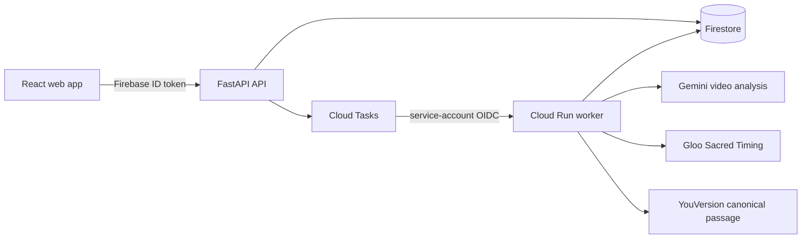

# STILL

**Watch first. Reflect later.**

STILL is a spoiler-safe reflection layer for story-led video. It analyzes a
public YouTube story in chronological audiovisual windows, keeps the first
watch quiet, and reveals a reflection only after the viewer has genuinely
reached the moment that grounds it. A safe `NO_ECHO` result is a successful
outcome when no proportionate Scripture connection is supported.

## Live product

Open [still-scriptures.web.app](https://still-scriptures.web.app).

This is the real hosted application, not a prepared sample:

- create an account with email and password, verify the email, sign in, and
  reset a forgotten password;
- submit any supported public or unlisted, embeddable YouTube video up to six
  minutes;
- see honest queued and per-window processing progress;
- watch through the original YouTube player with contiguous-frontier spoiler
  protection; and
- receive a verified reflection or an explicit `READY_NO_ECHO` result.

The Free plan includes one video analysis per account. A privately issued
Access Pass allows two analyses per UTC day. Payments are not integrated in
this release, and no access credential is published in the site or repository.

## Verified release status

| Area | Current status |
| --- | --- |
| Public app | Firebase Hosting deployed and browser-tested |
| Authentication | Firebase email/password sign-up, verification, sign-in, sign-out, and reset deployed |
| API and jobs | FastAPI on Cloud Run with Firestore and an authenticated Cloud Tasks worker |
| Real arbitrary-video gate | The submitted 5:58 YouTube test completed 9/9 full audiovisual windows through the hosted API in about 84 seconds and ended honestly as `READY_NO_ECHO` |
| Gemini | Live bounded audiovisual analysis verified |
| Gloo | Live structured acceptance and abstention verified; production allows at most one candidate per project |
| YouVersion | Canonical passage retrieval and attribution verified for accepted Echoes |
| Automated checks | 27 API tests and 3 web tests pass; typecheck, lint, and production build pass |

No new project becomes ready from fixtures, title-only analysis, captions-only
analysis, static Echoes, or fabricated provider output. Production startup
rejects fixture mode.

## Cost and abuse protection

- Free: one six-minute analysis for the lifetime of an account.
- Access Pass: two six-minute analyses per UTC day.
- Global service cap: twenty analyses per UTC day.
- Cloud Tasks dispatches one job at a time with at most two attempts.
- Cloud Run scales to zero and has a hard maximum of one instance.
- Each project allows at most one paid Gloo candidate and no escalation-model
  budget in the production configuration.
- Firestore usage reservations are atomic, so concurrent requests cannot bypass
  account or global limits.

## Architecture



Firebase web configuration is intentionally public client configuration.
Gemini, Gloo, YouVersion, and YouTube server credentials are stored in Secret
Manager and never compiled into the browser bundle. Browser access to
Firestore is denied; application data is available only through authenticated
API routes.

## Local setup

1. Copy `.env.example` to `.env`. Keep `APP_MODE=development` and
   `USE_PROVIDER_FIXTURES=false`.
2. Install web dependencies with `npm install`.
3. Create a Python virtual environment and run
   `pip install -r apps/api/requirements.txt`.
4. Start the API with `npm run api:dev`.
5. In another terminal, start the web app with `npm run dev`.

Local development may use the explicit development-user header. Set
`LOCAL_WORKER_ENABLED=true` only when intentionally spending live provider
quota.

## Verification

```powershell
npm run typecheck
npm run lint
npm run test:web
npm run build
.\.venv\Scripts\python.exe -m pytest apps/api/tests -q
```

See [deployment](docs/deployment.md), [architecture](docs/architecture.md),
[real end-to-end acceptance](docs/real-e2e-acceptance.md), and the
[competition materials](docs/submission).
