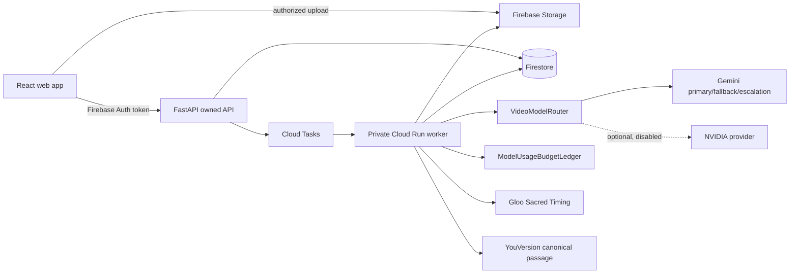

# STILL

**Watch first. Reflect later.**

STILL is a spoiler-safe reflection layer for story-led video. It prepares a source through chronological, bounded audiovisual windows, then keeps the first watch quiet. A reflection may surface only after the viewer has reached the relevant point; full-story reflection requires contiguous watched coverage and a natural ending.

## What is implemented

- Editorial **Still Grid** React experience: landing, add story, truthful processing, ready, watch, quiet reflections, Story Complete, and full reflection.
- Firebase-aware upload/auth client and owned FastAPI API.
- Firestore-compatible data store; production selects Firestore, not in-memory state.
- Cloud Tasks → private Cloud Run worker boundary; local execution is explicitly opt-in.
- `VideoUnderstandingProvider`, Gemini provider, disabled-by-default optional NVIDIA provider, `VideoModelRouter`, circuit breaker, and `ModelUsageBudgetLedger`.
- Bounded causal-window orchestration with immutable narrative state and per-window provenance.
- Spike-selectable Gloo Sacred Timing provider and canonical-only YouVersion passage client.
- HTML5 and YouTube playback adapters, watched-range tracking, contiguous-frontier gating, and spoiler-filtered Echo retrieval.
- Firebase rules, Cloud Run Dockerfile, deploy configuration, automated invariants, and verification documentation.

## Truthful integration status

| Integration | Status | Why |
| --- | --- | --- |
| Gemini video understanding | `LIVE_VERIFIED_BOUNDED` | A credentialed public-YouTube run passed chronological 0-40 s and 40-80 s audiovisual windows, then completed all 9 windows of the selected 5:58 source. |
| Gloo Sacred Timing | `LIVE_VERIFIED_DECISION` | One paid Completions V2 call returned a valid required-tool `NO_ECHO` decision. Production candidate calls are capped at two per project. |
| YouVersion retrieval | `LIVE_VERIFIED_RETRIEVAL` | Bible 3034 returned an exact passage, version metadata, and copyright attribution through the real API. |
| NVIDIA NIM | `BLOCKED_MISSING_CREDENTIALS` / disabled | Optional only; never required for release. |
| Firebase Hosting | `DEPLOYED_STATIC_SHOWCASE` | The public Spark-tier showcase is live at [still-scriptures.web.app](https://still-scriptures.web.app); it intentionally exposes no provider-backed controls. |
| Firestore / Cloud Tasks / Cloud Run | `NOT_DEPLOYED` | These services require billing for this architecture. The Firebase project remains on Spark, so the real backend is run locally for the demo. |

No newly submitted project becomes `READY` from fixtures, title analysis, captions-only analysis, static Echoes, or fabricated provider output. In production, startup rejects `USE_PROVIDER_FIXTURES=true`.

## Local setup

1. Copy `.env.example` to `.env`; keep `APP_MODE=development` and `USE_PROVIDER_FIXTURES=false`.
2. Install web packages: `npm install`.
3. Create a Python virtual environment, then `pip install -r apps/api/requirements.txt`.
4. Run API: `npm run api:dev`.
5. In another terminal run web: `npm run dev`.

For local UI-only work, Firebase is optional. Upload is honestly unavailable unless Firebase Storage variables are supplied. The development API uses an in-memory store; it does not invent provider output.

## Verification commands

```powershell
npm run typecheck
npm run lint
npm run test:web
npm run build
python -m pytest apps/api/tests -q
python tools/milestone1_preflight.py
```

The real provider verification commands and required evidence are in [docs/live-verification.md](docs/live-verification.md). The two mandatory real acceptance gates are recorded in [docs/real-e2e-acceptance.md](docs/real-e2e-acceptance.md).

Competition delivery materials are in [docs/submission](docs/submission): a Kaggle writeup, a sub-three-minute demo script, a readiness checklist, and the current product cover image.

## Architecture



Further details: [architecture](docs/architecture.md), [Spoiler Firewall](docs/adr-spoiler-firewall.md), [watched frontier](docs/adr-watched-frontier.md), [durable jobs](docs/adr-processing-jobs.md), and [deployment](docs/deployment.md).

For resuming this project in another Codex account or on a configured laptop,
start with the [Codex handoff](docs/codex-handoff.md). It records the current
truthful status, safety rules, implementation map, and mandatory live gates.

## Public showcase and deployment

The public, credential-free competition showcase is deployed at
[still-scriptures.web.app](https://still-scriptures.web.app). It is deliberately
static because the project remains on Firebase Spark; it never places Gemini,
Gloo, or YouVersion credentials in browser code and does not simulate an
interactive run. Use the local setup above for the real provider-backed flow.

For a future production backend, build the API from the repository root with
`apps/api/Dockerfile`, deploy it as a private Cloud Run service, then configure
Cloud Tasks OIDC to reach `/internal/jobs/{jobId}`. That path requires a billed
Google Cloud project. `scripts/deploy-cloud-run.ps1` is a guarded starting
command; it does not provision resources or upload secrets.

## Non-negotiable acceptance gates

1. **Milestone 5 staging:** a previously unseen rights-cleared source must pass real bounded Gemini audiovisual analysis, Gloo, YouVersion, verification, and Echo persistence. The selected test source completed as `READY_NO_ECHO`, so this gate is only partially satisfied.
2. **Final deployed acceptance:** the same kind of real flow must pass through the public frontend including playback, spoiler-lock, watched frontier, Story Complete, and exact canonical Scripture. The Spark-hosted site is a static showcase, so this gate remains open.

Mocks are permitted only in automated/local development tests. They can never satisfy either gate.
