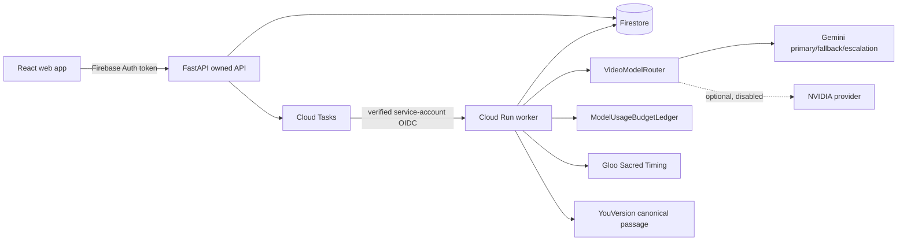

# STILL

**Watch first. Reflect later.**

STILL is a spoiler-safe reflection layer for story-led video. It prepares a source through chronological, bounded audiovisual windows, then keeps the first watch quiet. A reflection may surface only after the viewer has reached the relevant point; full-story reflection requires contiguous watched coverage and a natural ending.

## What is implemented

- Editorial **Still Grid** React experience: landing, add story, truthful processing, ready, watch, quiet reflections, Story Complete, and full reflection.
- Firebase-aware upload/auth client and owned FastAPI API.
- Firestore-compatible data store; production selects Firestore, not in-memory state.
- Cloud Tasks → authenticated Cloud Run worker boundary; local execution is explicitly opt-in.
- `VideoUnderstandingProvider`, Gemini provider, disabled-by-default optional NVIDIA provider, `VideoModelRouter`, circuit breaker, and `ModelUsageBudgetLedger`.
- Bounded causal-window orchestration with immutable narrative state and per-window provenance.
- Spike-selectable Gloo Sacred Timing provider and canonical-only YouVersion passage client.
- HTML5 and YouTube playback adapters, watched-range tracking, contiguous-frontier gating, and spoiler-filtered Echo retrieval.
- Firebase rules, Cloud Run Dockerfile, deploy configuration, automated invariants, and verification documentation.

## Truthful integration status

| Integration | Status | Why |
| --- | --- | --- |
| Gemini video understanding | `LIVE_VERIFIED_FULL_RUN` | Real bounded audiovisual analysis completed all seven chronological windows of the accepted 4:05 demo source. The application worker also completed 9/9 full audiovisual windows for the entrant-selected 5:58 test URL after a local-RPM cooldown fix. |
| Gloo Sacred Timing | `LIVE_VERIFIED_ACCEPT_AND_ABSTENTION` | Required-tool calls correctly returned `NO_ECHO` for two unsuitable projects and accepted one grounded candidate plus its final passage verification. Prepared-demo runs cap Gloo at one candidate. |
| YouVersion retrieval | `LIVE_VERIFIED_CANONICAL_ECHO` | Bible 3034 returned exact 1 Corinthians 1:27 text, BSB version metadata, and copyright attribution for the persisted Echo. |
| NVIDIA NIM | `BLOCKED_MISSING_CREDENTIALS` / disabled | Optional only; never required for release. |
| Firebase Auth / Firestore / Hosting | `DEPLOYED_PREPARED_DEMO` | [still-scriptures.web.app](https://still-scriptures.web.app) anonymously authenticates judges and retrieves one exact accepted provider result. Browser writes and collection listing are denied. |
| Cloud Tasks / Cloud Run | `READY_BUT_BILLING_BLOCKED` | The arbitrary public-YouTube path, OIDC task verification, Firestore quotas, Secret Manager wiring, one-instance deployment, and Firebase Hosting rewrite are implemented. Deployment correctly stops until the project owner links Blaze billing. |

No newly submitted project becomes `READY` from fixtures, title analysis, captions-only analysis, static Echoes, or fabricated provider output. In production, startup rejects `USE_PROVIDER_FIXTURES=true`.

## Local setup

1. Copy `.env.example` to `.env`; keep `APP_MODE=development` and `USE_PROVIDER_FIXTURES=false`. Set `LOCAL_WORKER_ENABLED=true` only when you intentionally want real local provider calls.
2. Install web packages: `npm install`.
3. Create a Python virtual environment, then `pip install -r apps/api/requirements.txt`.
4. Run API: `npm run api:dev`.
5. In another terminal run web: `npm run dev`.

For local development, Firebase is optional because the owned API accepts the
explicit development user header. The competition UI accepts public YouTube
URLs only; upload support is not presented as a working release feature. The
development API uses an in-memory store and does not invent provider output.

## Verification commands

```powershell
npm run typecheck
npm run lint
npm run test:web
npm run build
python -m pytest apps/api/tests -q
python tools/milestone1_preflight.py
```

The real provider verification commands and required evidence are in [docs/live-verification.md](docs/live-verification.md). The two mandatory real acceptance gates are recorded in [docs/real-e2e-acceptance.md](docs/real-e2e-acceptance.md).

Competition delivery materials are in [docs/submission](docs/submission): a Kaggle writeup, a sub-three-minute demo script, a readiness checklist, and the current product cover image.

## Architecture



Further details: [architecture](docs/architecture.md), [Spoiler Firewall](docs/adr-spoiler-firewall.md), [watched frontier](docs/adr-watched-frontier.md), [durable jobs](docs/adr-processing-jobs.md), and [deployment](docs/deployment.md).

For resuming this project in another Codex account or on a configured laptop,
start with the [Codex handoff](docs/codex-handoff.md). It records the current
truthful status, safety rules, implementation map, and mandatory live gates.

## Public judge demo

Open [still-scriptures.web.app](https://still-scriptures.web.app), choose
**Judge demo**, and enter `STILL-JUDGE-2026`. No personal login is required:
Firebase creates a temporary anonymous session and reads a single hashed demo
record. The video is the original public YouTube embed. Watched coverage,
spoiler filtering, the 3:20 Echo cutoff, Story Complete, and full reflection are
interactive in the browser.

The Echo was prepared by a real seven-window Gemini → Gloo → YouVersion → Gloo
verification run and is bound to that exact source. This is a prepared demo,
not a fixture and not an open processing backend. New sources still require the
local backend setup above. The public client contains Firebase's normal public
web configuration only; Gemini, Gloo, and YouVersion credentials remain local.

The arbitrary-source production release is implemented for public or unlisted,
embeddable YouTube videos up to six minutes. It uses authoritative YouTube
metadata, two real analyses per anonymous guest per day, twenty total per day,
at most one paid Gloo candidate, Cloud Run max instances `1`, and a
one-at-a-time Cloud Tasks queue. `scripts/deploy-production.ps1` provisions the
runtime identities, restricted secrets, image, queue, Hosting rewrite, and
smoke check. It deliberately stops before mutation while Firebase billing is
unlinked.

## Non-negotiable acceptance gates

1. **Milestone 5 staging:** the technical pipeline gate passed on Dogs Inc's public release of “Pip”: seven real audiovisual windows, Gloo acceptance, YouVersion retrieval, Gloo verification, and Echo persistence. Copyright remains with the source owners; STILL embeds rather than rehosts it.
2. **Final deployed acceptance:** the public prepared-demo path has passed anonymous Firebase retrieval, real YouTube playback, zero early Echoes, natural-ending Story Complete, and exact canonical rendering. The real arbitrary-source worker also completed the entrant's 5:58 video with 9/9 full audiovisual windows and an honest `READY_NO_ECHO`; public arbitrary submission remains blocked only by the owner-controlled Blaze switch and post-deploy browser acceptance.

Mocks are permitted only in automated/local development tests. They can never satisfy either gate.
