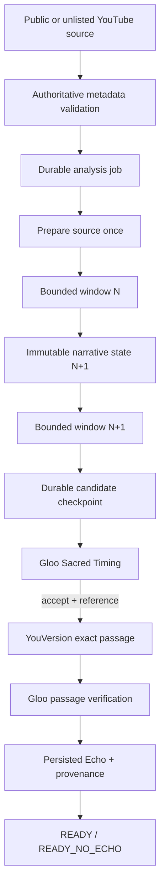

# Architecture

## Trust boundaries

- Browser clients use verified Firebase email/password accounts; the API owns workflow state, allowance enforcement, and project data.
- Firebase Admin / Firestore / Cloud Tasks are server-side only.
- Cloud Run accepts network traffic so Firebase Hosting can proxy `/api`, but every API route verifies a Firebase token and ownership. Cloud Tasks additionally requires a verified Google OIDC token with the configured audience and service-account email.
- Only Gemini handles audiovisual video analysis. A missing or degraded modality produces abstention/degraded output, never a sensitive inference.
- Gloo assesses whether a candidate deserves a reflection; it does not provide canonical Bible text.
- YouVersion is the only origin for text rendered as Scripture.

## Source reuse and causal scope

The worker prepares one Gemini-compatible source reference, then sends that same reference in chronological requests with exact `VideoMetadata.start_offset` and `end_offset`. The model receives the current immutable narrative state and no future interval. Structural preparation may inspect duration and codecs only; it cannot create narrative conclusions.

Each eligible observation is stored as a deterministic, project-scoped reflection candidate before Gloo is called. A repeated Cloud Task resumes candidates that remain pending; a final Echo uses the candidate ID, so at-least-once task delivery cannot create a duplicate reflection.

## Provider hierarchy

1. Configured Gemini high-throughput primary.
2. Equivalent Gemini Flash-Lite fallback after retryable primary failure.
3. Stronger Gemini escalation only for high-value ambiguity under budget.
4. Transparent retriable failure/delayed retry.

NVIDIA is outside this reliable hierarchy. It is hidden behind the provider interface, disabled by default, and only becomes a route after the optional capability spike proves audiovisual support.

## Data retention

Projects, sources, windows, narrative-state snapshots, Echoes, and sessions are scoped by owner. Per-window provenance is retained without raw chain-of-thought. The competition release embeds public YouTube sources and does not rehost their media. A future upload release must add an owned retention job that deletes Firestore records and corresponding Storage objects together.
